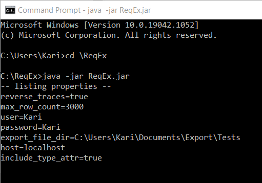
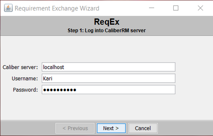
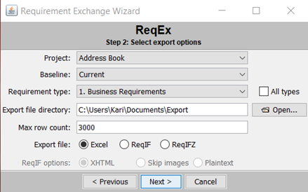
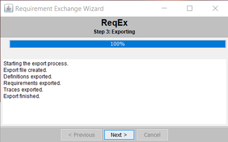
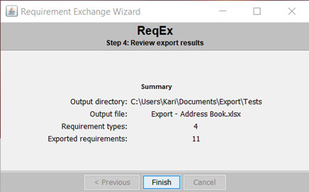
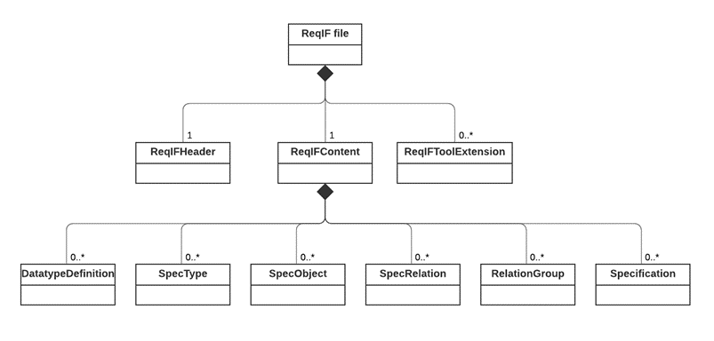
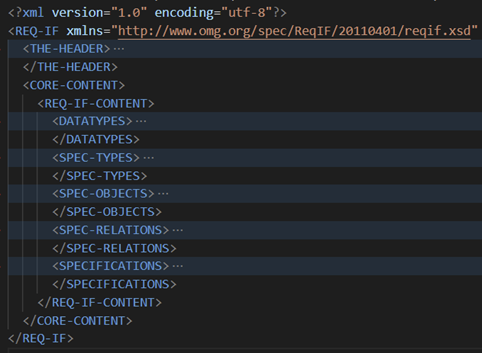
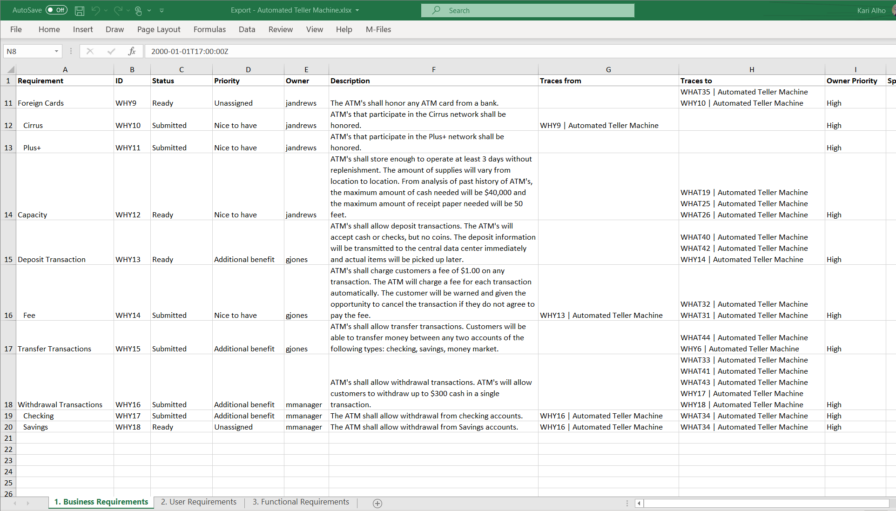

# ReqEx Installation and User Guide

Kari Alho 10.10.2021
## Background and requirements
ReqEx is a standalone export tool for Micro Focus Caliber requirement management tool. It is built using the SDK Java library that is distributed together with Caliber. It therefore always requires an active connection and user credentials with a Caliber (version 11.5 or higher) server to work. The tool is developed by ImproveIt Oy. Source code is published as open source with the Apache License 2.0.

Other system requirements are:

- Operating system: Windows 10 (Caliber native libraries require this)
- Installed Caliber SDK (64-bit) version 11.5 or higher in the default install localtion:
  C:\Program Files (x86)\Borland\CaliberRM SDK 11.5
- Enough disk space for the export files.

## Building
The provided Maven pom.xml file lists all the required libararies to compile the system. You can use your faforite IDE to compile the project based on pom.xml.

Note that the jar files from the Caliber SDK are listed with system scope, and so they are not necessary copied into the executable jar if you are using maven as the build tool. I have used the IntelliJ IDEA (Community Edition) to build the executable jar without issues.
## Installation
Once you have the executable jar with dependent libraries ready you can copy it into a suitable installation directory.
## Running ReqEx
Open Windows command prompt and CD to the installation directory.



Enter **java -jar ReqEx.jar** to the command line.

You should now see some informational output in the console. The ReqEx login screen should appear on your desktop.
### Step 1: Log in


Enter the hostname or ip address of your Caliber server, together with the Caliber username and password. Access right to the Caliber system, e.g., projects you can use are dependent on the access rights of this user.

Once done, click ‘Next >’.
### Step 2: Select data to be exported and options


In this step you will make all the necessary selections for the actual export. The selections are slightly different for Excel and ReqIF exports, but the data source is common. The following table describes the fields and selections available:

|**Field/Option**|**Description**|
| :- | :- |
|Project|A drop-down list for available projects from Caliber.|
|Baseline|A drop-down list of Baselines of the selected project.|
|Requirement type|A drop-down list of Requirement types of the selected project/baseline.|
|All types|A checkbox for all requirement types. If checked, all requirement types associated with the project/baseline are exported. The Requirement type list will be made inactive if this box is checked.|
|Export file directory|The directory where all files produced by the export will be saved into. File naming will be explained in section *Export file naming* below.<br>**Note**: Existing files with same names will be overwritten.|
|Open…|This will open a file selection dialog allowing one to select the export file directory interactively. Using this is optional, as the value in the Export file directory text field will always be used.|
|Max row count|This field can be used to specify maximum number of requirements to be exported. Requirements exceeding that limit shall not be exported. If the field is left empty, no limits are used.|
|Export File|<p>Export type is selected with this option (only one can be selected):</p><p>**Excel**: Exports one .xlsx Excel file, with separate worksheets for every requirement type (if applicable). The Excel file does not contain images or HTML-based descriptions.</p><p>**ReqIF**: Exports one .reqif (XML) file in the Requirement Interchange Format. Images are exported in the same directory, if applicable (XHTML option below).</p><p>**ReqIFZ**: Exports one .reqifz file in the Requirement Interchange Format. This basically the ReqIF export output zipped into one file. Images and the original .reqif file are retained for reference.</p>|
|ReqIF options|<p>This selection affects how images and Caliber’s HTML-based requirement descriptions are handled:</p><p>**XHTML**: HTML-based descriptions are transformed into XHTML and images are saved in separate .png files.</p><p>**Skip images**: XHTML descriptions, but the images will not be saved.</p><p>**Plaintext**: Descriptions will be saved in plaintext only.</p>These options are enabled only if ReqIF or ReqIFZ is selected above.|

To start the export with the specified data and option selections, click the button ‘Next >’ again.
### Step 3: Exporting


After the export starts, the tool displays a progress bar, together with messages indicating completion of various steps for the export. To display the results, click ‘Next >’ again.
### Step 4: Reviewing results


In this step the tool displays a summary of the export, including output directory, export file, and the number of requirement types and requirements exported.

You can close the ReqEx tools by clicking ‘Finish’.
### Export file naming
The following file names will be used by the export. Following placeholders will be replaced with actual data from Caliber:

- \[Project\]: the Caliber Project name
- \[Requirement type\]: the Requirement type from Caliber

|**File**|**Naming**|
| :- | :- |
|Excel export|<p>“Export - \[Project\] - <Requirement type>.xlsx” (for a requirement type specific export) or</p><p>“Export - \[Project\].xlsx” (for an export with all available requirement types)</p>|
|ReqIF export|<p>“Export - \[Project\] - <Requirement type>.reqif” or</p><p>“Export - \[Project\].reqif”</p>|
|ReqIFZ export|<p>“Export - \[Project\] - <Requirement type>.reqifz” or</p><p>“Export - \[Project\].reqifz”</p>|
|Images|<p>\[UUID\].png (e.g. 9E632019-BC09-4F67-87A6-6FD43437F2A1.png)</p><p>jpg, gif and bmp images will be converted to png. Original files will be retained in the export directory (but not in the .reqifz archive, if applicable).</p>|
|Logs|<p>By default, a directory named *log* will be used in the installation directory for export logs.</p><p>A new export will be generated for every export, with the default log filename format of:</p><p>yyyy-MM-dd HH-mm-ss reqEx.log</p><p></p><p>Logging utilizes [logback](http://logback.qos.ch/) and it can be configured further by modifying the resources/logback.xml configuration file.</p>|

### Properties
ReqEx also uses a Java Properties file to save some default commonly used field values and enable some more rarely used options to be changed. The property file is named **.reqex** in the user’s home directory. The tool will store a new property file if one does not exist.

The following settings/defaults can be specified in the property file:

|**Property**|**Description**|
| :- | :- |
|host|Default hostname for Caliber server|
|user|Default username|
|export\_file\_dir|Default directory for export files|
|max\_row\_count|Default maximum number of requirements to export|
|reverse\_traces|<p>Boolean setting that controls the direction of the traces in the ReqIF file.</p><p>Normally a Caliber trace from A to B, would export in ReqIF as a SPEC-RELATION with SOURCE A and TARGET B. With the setting reverse\_traces=true, this can be reversed, so that SOURCE would be B and TARGET A.</p><p>Default setting is false.</p>|
|include\_type\_attr|<p>Boolean setting that can be used to add an enumeration attribute Type to every exported requirement. This can be used to flag requirements having child requirements, since a value “Folder” is used for those. Leaf requirements are assigned a value “Functional”.</p><p>Default setting is false (Type attribute will not be added).</p>|

Example properties file:

```txt
host=localhost
user=Kari
export_file_dir=C\:\\Users\\Kari\\Documents\\Export
max_row_count=3000
reverse_traces=false
include_type_attr=true
```
## Exported ReqIF file
[Requirements Interchange Format](https://www.omg.org/reqif/) (ReqIF) is OMG's standard for transferring requirements and specifications from one system and organisation to another. It is an ideal export format if you plan to later use the file as input to another requirement tool that supports it.

ReqIF file is an XML file conforming to the ReqIF schema specification. In practice, it contains a Header section, a Content section, and an optional ToolExtension (not used by ReqEx) section. The Content section contains various sub-sections representing different aspects of the requirements data (see the Content chapter below). The overall structure is illustrated below as a class diagram.


### Header
The header contains general metadata about the export and the export tool. The ReqEx tool will export a header like this:

```XML
<THE-HEADER>
  <REQ-IF-HEADER IDENTIFIER="id-12dd6df5-52d3-4e46-a755-28a70633d6ff">
    <COMMENT>Export from Micro Focus Caliber, executed by Kari Alho</COMMENT>
    <CREATION-TIME>2021-09-05T21:40:13Z</CREATION-TIME>
    <REPOSITORY-ID>localhost</REPOSITORY-ID>
    <REQ-IF-TOOL-ID>ReqEx by ImproveIt Oy</REQ-IF-TOOL-ID>
    <REQ-IF-VERSION>1.0</REQ-IF-VERSION>
    <SOURCE-TOOL-ID>Micro Focus Caliber 11.5.10.841</SOURCE-TOOL-ID>
    <TITLE>Project: Address Book: 1. Business Requirements</TITLE>
  </REQ-IF-HEADER>
</THE-HEADER>
```
The header is identified with an UUID, and it contains several attributes, such as creation time, repository id (the Caliber server hostname), source tool id (Caliber server version number), and tile (project and requirement type name of the export).
### Content
The output from ReqEx uses the following content subsections mapped to specific data in Caliber.

|**ReqIF Content section**|**Caliber data**|
| :- | :- |
|Datatypes|<p>All system attribute types (such as String, Boolean, Date, XHTML for Description, Status and Priority) and user defined attribute types included in the export are listed here.</p>For each selection list (enumeration in ReqIF) attribute, the allowed values are also listed as ENUM-VALUES.|
|SpecTypes|Each Caliber requirement type corresponds to one ReqIF SPEC-OBJECT-TYPE. Each can contain a specific set of SPEC-ATTRIBUTES, corresponding to either system or user-defined attribute types from the DATATYPES section.|
|SpecObjects|This section contains full set of requirements corresponding to the scope of the export. Values for all the attributes are specified in the VALUES section. No hierarchical relationships are specified (these are in the Specifications section).|
|SpecRelations|<p>This section lists the relations between requirements, in Caliber terms the traces from one requirement to other ones. The suspect value of the trace is provided as an attribute.</p>Only traces within the Caliber project or the requirement type exported are specified in the file.|
|Specifications|This section includes a requirement “specification”. It specifies the hierarchy of requirements in one type referencing the objects in the SpecObjects section.|

As a summary, the complete ReqIF file has a structure like this:


## Exported Excel file
The Excel file output is an .xlsx file with each Caliber requirement type exported to a separate Excel worksheet.

The first row of the file contains column headings, and the following lines are the exported requirements, one per line.

Following columns are exported:

|**Column**|**Description**|
| :- | :- |
|Requirement|The Name of the requirement. Each child requirment is indented under the parent.|
|ID|Tag (short type identifier) + the requirement ID|
|Status|Status system attribute|
|Priority|Priority system attribute|
|Owner|Owner system attribute. Only username is exported.|
|Description|The requirement description, in plain text (no HTML formatting).|
|Traces from|Traces from the requirement are displayed one per line with notation:<br>\[TAG\]\[ID\] \| \[Project\]|
|Traces to|Traces to the requirement are displayed one per line with notation:<br>\[TAG\]\[ID\] \| \[Project\]|
|User defined attributes|Remaining columns are used for Caliber UDAs, one per column.|

A screenshot from Excel with the export of a sample Caliber project “Automated Teller Machine” is illustrated below.

